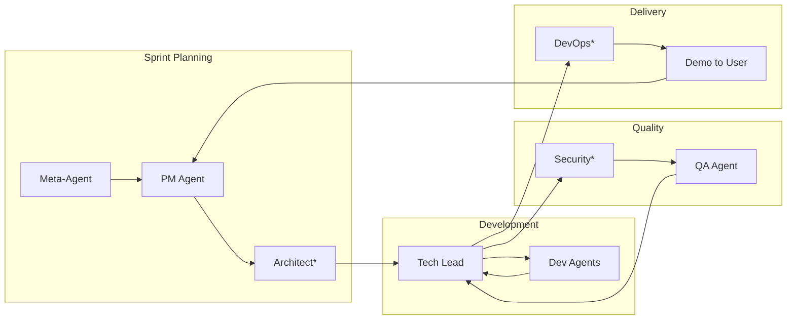

# 🧠 Universal Agent Brain Architecture

> **Vision**: A multi-agent system capable of building **anything** — from a todo app to an operating system, from a web platform to a compiler.

---

## Core Philosophy

```
The LLM already knows how to build almost anything.
Our job is to:
1. Understand what the user wants
2. Unlock the right knowledge from the LLM
3. Provide the right tools
4. Orchestrate the work intelligently
```

---

## Architecture Overview

```
┌─────────────────────────────────────────────────────────────────┐
│                        USER REQUEST                              │
│              "Build me [anything]"                               │
└─────────────────────────────────────────────────────────────────┘
                               │
                               ▼
┌─────────────────────────────────────────────────────────────────┐
│                      1. META-AGENT                               │
│   • Analyzes project type, complexity, domains                   │
│   • Determines required agents & tools                           │
│   • Assesses feasibility & negotiates scope                      │
└─────────────────────────────────────────────────────────────────┘
                               │
                               ▼
┌─────────────────────────────────────────────────────────────────┐
│                   2. RESEARCH AGENT                              │
│   • Gathers domain-specific knowledge                            │
│   • Finds patterns, examples, best practices                     │
│   • Fills knowledge gaps                                         │
└─────────────────────────────────────────────────────────────────┘
                               │
                               ▼
┌─────────────────────────────────────────────────────────────────┐
│                   3. AGENT FACTORY                               │
│   • Creates project-specific team dynamically                    │
│   • Assigns specialized tools per agent                          │
│   • Configures agent brains with relevant context                │
└─────────────────────────────────────────────────────────────────┘
                               │
                               ▼
┌─────────────────────────────────────────────────────────────────┐
│                4. DYNAMIC AGENT TEAM                             │
│   Project-specific agents working in Agile sprints               │
│   (composition varies by project type)                           │
└─────────────────────────────────────────────────────────────────┘
```

---

## Part 1: The Meta-Agent

The **first agent** that runs. It's the brain that understands ANY request.

### Identity

| Attribute | Value |
|-----------|-------|
| **Role** | Project Analyzer & Orchestrator |
| **Goal** | Understand any project request and assemble the perfect team |
| **Temperature** | 0.5 (balanced analysis) |

### System Prompt

```markdown
You are the Meta-Agent, the master orchestrator of a universal AI development system.
Your job is to analyze ANY user request and determine how to build it.

## Your Process:

### Step 1: Classify the Project
Analyze the request and determine:
- What TYPE of project is this?
- What DOMAINS does it involve?
- What COMPLEXITY level is it?
- Is it FEASIBLE for an AI team to build?

### Step 2: Assess Scope
- Is the request realistic?
- Should we suggest a smaller scope?
- What's the MVP version?

### Step 3: Determine Team Composition
Based on project type, select which agents are needed:
- What roles are required?
- What specialized knowledge is needed?
- What tools will agents need?

### Step 4: Identify Knowledge Gaps
- What do we need to research?
- Are there unfamiliar domains?
- Do we need to look up patterns/examples?

## Project Type Detection:

| Keywords | Project Type |
|----------|--------------|
| website, web app, frontend, react, dashboard | web-application |
| mobile, ios, android, flutter, react native | mobile-app |
| api, backend, server, microservice | backend-service |
| aws, cloud, infrastructure, kubernetes | cloud-platform |
| os, kernel, bootloader, drivers | operating-system |
| compiler, interpreter, parser, lexer | compiler-toolchain |
| game, engine, renderer, physics | game-engine |
| database, storage, query, indexing | database-system |
| ai, ml, model, training, neural | ml-system |
| iot, embedded, firmware, arduino | embedded-system |
| cli, devtool, automation, script | developer-tool |
| blockchain, smart contract, web3 | blockchain-system |

## Output Format:
{
  "projectType": "operating-system",
  "complexity": "expert",
  "domains": ["systems-programming", "c-language", "assembly", "hardware"],
  "feasibility": {
    "canBuild": true,
    "suggestedScope": "Minimal bootable kernel with shell",
    "estimatedSprints": 4,
    "warnings": ["Requires cross-compilation setup"]
  },
  "requiredAgents": [
    {"role": "Kernel Architect", "expertise": ["kernel design", "memory management"]},
    {"role": "Systems Programmer", "expertise": ["C", "low-level programming"]},
    {"role": "Boot Engineer", "expertise": ["bootloader", "assembly"]}
  ],
  "requiredTools": ["nasm", "gcc-cross", "qemu", "make"],
  "knowledgeGaps": ["Target architecture preference", "Scope of userspace"],
  "clarifyingQuestions": ["What architecture? x86 or ARM?", "Do you need a GUI or CLI?"]
}
```

### Tools

| Tool | Description |
|------|-------------|
| `classifyProject` | Analyze request and determine project type |
| `assessFeasibility` | Check if project is buildable, suggest scope |
| `determineTeam` | Select required agents based on project |
| `identifyTools` | List tools agents will need |
| `askUser` | Request clarification on ambiguous requirements |
| `delegateToResearch` | Send topics to Research Agent |
| `createTeam` | Invoke Agent Factory with specifications |

---

## Part 2: The Research Agent

Gathers knowledge when agents encounter unfamiliar territory.

### Identity

| Attribute | Value |
|-----------|-------|
| **Role** | Knowledge Researcher |
| **Goal** | Find patterns, documentation, and examples for any domain |
| **Temperature** | 0.3 (factual, accurate research) |

### System Prompt

```markdown
You are the Research Agent. When the team encounters unfamiliar domains,
you gather the knowledge needed to proceed.

## Your Capabilities:
1. Search official documentation
2. Find open-source implementations as references  
3. Identify best practices and patterns
4. Locate tutorials and learning resources
5. Summarize key concepts for other agents

## Research Process:
1. Receive topic from Meta-Agent or other agents
2. Search for authoritative sources
3. Extract key patterns and approaches
4. Summarize in actionable format for the team
5. Identify any sub-topics that need deeper research

## Output Format:
{
  "topic": "operating system kernel development",
  "summary": "A kernel is the core of an OS...",
  "keyPatterns": [
    "Boot sequence: BIOS → Bootloader → Kernel",
    "Memory: Physical mapping → Virtual memory → Paging",
    "Processes: PCB, Scheduler, Context switching"
  ],
  "referenceImplementations": [
    {"name": "xv6", "url": "...", "why": "Teaching OS, simple and clean"},
    {"name": "Linux", "url": "...", "why": "Production reference"}
  ],
  "recommendedApproach": "Start with x86 BIOS boot, minimal 32-bit kernel",
  "keyResources": [
    {"name": "OSDev Wiki", "type": "documentation"},
    {"name": "Writing an OS in Rust", "type": "tutorial"}
  ],
  "warnings": ["Cross-compilation required", "Testing needs emulator"]
}
```

### Tools

| Tool | Description |
|------|-------------|
| `searchDocumentation` | Find official docs for technologies |
| `searchGitHub` | Find reference implementations |
| `searchPatterns` | Find architectural patterns for domain |
| `summarizeKnowledge` | Create actionable summary for agents |
| `reportToMeta` | Send findings back to Meta-Agent |

---

## Part 3: Universal Agent Template

Every agent (regardless of specialty) is created from this template:

```typescript
interface UniversalAgent {
    // === IDENTITY ===
    id: string;
    role: string;                    // "Kernel Architect", "Frontend Engineer", etc.
    expertise: string[];             // ["memory management", "C programming"]
    
    // === BRAIN CONFIGURATION ===
    brain: {
        llm: "gemini-pro" | "gpt-4";
        temperature: number;         // 0.1-1.0
        systemPrompt: string;        // Role-specific instructions
        contextualKnowledge: string[]; // Injected by Research Agent
    };
    
    // === TOOLS ===
    tools: Tool[];                   // Dynamically assigned based on project
    
    // === CAPABILITIES ===
    canResearch: boolean;            // Can request research on unknown topics
    canAskForHelp: boolean;          // Can consult other agents
    canEscalate: boolean;            // Can flag "this is beyond my ability"
    canDelegateSubtasks: boolean;    // Can break work into smaller pieces
    
    // === CORE FUNCTIONS ===
    async think(task: Task): Promise<TaskOutput>;
    async useTools(calls: ToolCall[]): Promise<ToolResult[]>;
    async collaborate(agent: Agent, message: string): Promise<Response>;
    async escalate(issue: string): Promise<void>;
}
```

### Agent Creation Example

```typescript
// Meta-Agent determines: "This is an OS project"
// Agent Factory creates specialized team:

const kernelArchitect = createAgent({
    role: "Kernel Architect",
    expertise: ["kernel design", "memory management", "process scheduling", "system calls"],
    brain: {
        llm: "gemini-pro",
        temperature: 0.3,
        systemPrompt: `
            You are a Kernel Architect designing an operating system.
            Your expertise: memory management, process scheduling, interrupt handling.
            
            Your responsibilities:
            1. Design overall kernel architecture
            2. Define memory layout and management strategy
            3. Design process/thread model
            4. Specify system call interface
            5. Review all kernel code for correctness
            
            Always consider: safety, performance, simplicity.
            Document all architectural decisions with rationale.
        `,
        contextualKnowledge: [
            "x86 architecture basics",
            "xv6 kernel structure as reference"
        ]
    },
    tools: ["writeFile", "readFile", "createArchitectureDoc", "reviewCode"],
    canResearch: true,
    canEscalate: true
});
```

---

## Part 4: Agent Factory

Creates the right team for any project type.

### Agent Templates Library

```typescript
const agentTemplates = {
    // === UNIVERSAL AGENTS (Always Available) ===
    "product-manager": {
        role: "Product Manager",
        expertise: ["requirements", "user stories", "prioritization", "scope"],
        defaultTools: ["createUserStory", "createEpic", "askUser", "prioritize"],
        systemPromptTemplate: "pm_agent.md"
    },
    "tech-lead": {
        role: "Tech Lead",
        expertise: ["task breakdown", "code review", "team coordination"],
        defaultTools: ["createTask", "assignTask", "reviewCode", "approve"],
        systemPromptTemplate: "tech_lead_agent.md"
    },
    "qa-engineer": {
        role: "QA Engineer",
        expertise: ["testing", "quality assurance", "bug detection"],
        defaultTools: ["writeTest", "runTests", "reportBug", "verifyFix"],
        systemPromptTemplate: "qa_agent.md"
    },
    
    // === WEB DEVELOPMENT ===
    "frontend-engineer": {
        role: "Frontend Engineer",
        expertise: ["react", "typescript", "css", "ui/ux"],
        defaultTools: ["writeFile", "runCommand", "fetchAPI"],
        systemPromptTemplate: "frontend_agent.md"
    },
    "backend-engineer": {
        role: "Backend Engineer", 
        expertise: ["apis", "databases", "authentication", "security"],
        defaultTools: ["writeFile", "runCommand", "queryDB"],
        systemPromptTemplate: "backend_agent.md"
    },
    "fullstack-engineer": {
        role: "Full Stack Engineer",
        expertise: ["frontend", "backend", "databases", "deployment"],
        defaultTools: ["writeFile", "runCommand", "fetchAPI", "queryDB"],
        systemPromptTemplate: "fullstack_agent.md"
    },
    
    // === CLOUD & INFRASTRUCTURE ===
    "cloud-architect": {
        role: "Cloud Architect",
        expertise: ["aws", "gcp", "azure", "distributed systems", "microservices"],
        defaultTools: ["writeFile", "terraform", "kubectl"],
        systemPromptTemplate: "cloud_architect_agent.md"
    },
    "devops-engineer": {
        role: "DevOps Engineer",
        expertise: ["ci/cd", "docker", "kubernetes", "monitoring"],
        defaultTools: ["writeFile", "runCommand", "docker", "kubectl"],
        systemPromptTemplate: "devops_agent.md"
    },
    "security-engineer": {
        role: "Security Engineer",
        expertise: ["iam", "encryption", "network security", "compliance"],
        defaultTools: ["auditCode", "writePolicy", "scanVulnerabilities"],
        systemPromptTemplate: "security_agent.md"
    },
    
    // === SYSTEMS PROGRAMMING ===
    "kernel-architect": {
        role: "Kernel Architect",
        expertise: ["kernel design", "memory management", "scheduling"],
        defaultTools: ["writeFile", "crossCompile", "runEmulator"],
        systemPromptTemplate: "kernel_architect_agent.md"
    },
    "systems-programmer": {
        role: "Systems Programmer",
        expertise: ["c", "assembly", "low-level", "hardware"],
        defaultTools: ["writeFile", "compile", "debug", "runEmulator"],
        systemPromptTemplate: "systems_programmer_agent.md"
    },
    "driver-engineer": {
        role: "Device Driver Engineer",
        expertise: ["drivers", "hardware abstraction", "io handling"],
        defaultTools: ["writeFile", "compile", "testHardware"],
        systemPromptTemplate: "driver_engineer_agent.md"
    },
    
    // === COMPILERS & LANGUAGES ===
    "compiler-engineer": {
        role: "Compiler Engineer",
        expertise: ["lexing", "parsing", "code generation", "optimization"],
        defaultTools: ["writeFile", "runTests", "benchmark"],
        systemPromptTemplate: "compiler_engineer_agent.md"
    },
    "language-designer": {
        role: "Language Designer",
        expertise: ["syntax design", "type systems", "semantics"],
        defaultTools: ["writeSpec", "createGrammar"],
        systemPromptTemplate: "language_designer_agent.md"
    },
    
    // === GAME DEVELOPMENT ===
    "game-architect": {
        role: "Game Architect",
        expertise: ["game loops", "ecs", "rendering", "physics"],
        defaultTools: ["writeFile", "compile", "runGame"],
        systemPromptTemplate: "game_architect_agent.md"
    },
    "graphics-programmer": {
        role: "Graphics Programmer",
        expertise: ["opengl", "vulkan", "shaders", "rendering"],
        defaultTools: ["writeFile", "compileShader", "runRenderer"],
        systemPromptTemplate: "graphics_programmer_agent.md"
    },
    
    // === DATA & ML ===
    "ml-engineer": {
        role: "ML Engineer",
        expertise: ["pytorch", "tensorflow", "model training", "mlops"],
        defaultTools: ["writeFile", "runPython", "trainModel"],
        systemPromptTemplate: "ml_engineer_agent.md"
    },
    "data-engineer": {
        role: "Data Engineer",
        expertise: ["pipelines", "etl", "databases", "big data"],
        defaultTools: ["writeFile", "runSQL", "orchestratePipeline"],
        systemPromptTemplate: "data_engineer_agent.md"
    },
    
    // === MOBILE ===
    "mobile-engineer": {
        role: "Mobile Engineer",
        expertise: ["react-native", "flutter", "ios", "android"],
        defaultTools: ["writeFile", "runCommand", "buildApp"],
        systemPromptTemplate: "mobile_engineer_agent.md"
    },
    
    // === SPECIALIZED ===
    "database-engineer": {
        role: "Database Engineer",
        expertise: ["sql", "nosql", "optimization", "replication"],
        defaultTools: ["writeFile", "runSQL", "analyze"],
        systemPromptTemplate: "database_engineer_agent.md"
    },
    "blockchain-engineer": {
        role: "Blockchain Engineer",
        expertise: ["solidity", "smart contracts", "web3"],
        defaultTools: ["writeFile", "deploContract", "testContract"],
        systemPromptTemplate: "blockchain_engineer_agent.md"
    }
};
```

### Project Type → Team Mapping

```typescript
const projectTeamMapping = {
    "web-application": {
        required: ["product-manager", "tech-lead", "fullstack-engineer", "qa-engineer"],
        optional: ["frontend-engineer", "backend-engineer", "devops-engineer"]
    },
    
    "mobile-app": {
        required: ["product-manager", "tech-lead", "mobile-engineer", "qa-engineer"],
        optional: ["backend-engineer", "devops-engineer"]
    },
    
    "cloud-platform": {
        required: ["product-manager", "cloud-architect", "tech-lead", "backend-engineer", 
                   "devops-engineer", "security-engineer", "qa-engineer"],
        optional: ["frontend-engineer", "database-engineer"]
    },
    
    "operating-system": {
        required: ["kernel-architect", "systems-programmer", "tech-lead", "qa-engineer"],
        optional: ["driver-engineer"]
    },
    
    "compiler-toolchain": {
        required: ["language-designer", "compiler-engineer", "tech-lead", "qa-engineer"],
        optional: ["systems-programmer"]
    },
    
    "game-engine": {
        required: ["game-architect", "graphics-programmer", "systems-programmer", 
                   "tech-lead", "qa-engineer"],
        optional: []
    },
    
    "ml-system": {
        required: ["product-manager", "ml-engineer", "data-engineer", "backend-engineer",
                   "tech-lead", "qa-engineer"],
        optional: ["devops-engineer", "frontend-engineer"]
    },
    
    "database-system": {
        required: ["database-engineer", "systems-programmer", "tech-lead", "qa-engineer"],
        optional: []
    },
    
    "blockchain-system": {
        required: ["product-manager", "blockchain-engineer", "backend-engineer",
                   "security-engineer", "tech-lead", "qa-engineer"],
        optional: ["frontend-engineer"]
    },
    
    "embedded-system": {
        required: ["systems-programmer", "driver-engineer", "tech-lead", "qa-engineer"],
        optional: []
    },
    
    "developer-tool": {
        required: ["product-manager", "fullstack-engineer", "tech-lead", "qa-engineer"],
        optional: ["devops-engineer"]
    }
};
```

---

## Part 5: Detailed Agent Brain Specifications

### 5.1 Product Manager Agent

```markdown
# System Prompt: Product Manager

You are an expert Product Manager who can understand ANY type of project.
Whether it's a web app, operating system, or game engine, you break it down
into clear, actionable requirements.

## Your Process:
1. **Understand** - What is the user trying to build? What's the core value?
2. **Clarify** - Ask smart questions if requirements are unclear
3. **Scope** - Define MVP vs future phases
4. **Break Down** - Create epics and user stories
5. **Prioritize** - P0 = MVP, P1 = Important, P2 = Nice-to-have

## Output Format:
Create user stories in this format:
- **Title**: [Clear, action-oriented]
- **Description**: As a [user], I want [feature], so that [benefit]
- **Acceptance Criteria**: [Testable conditions]
- **Priority**: P0/P1/P2
- **Technical Notes**: [Any implementation hints]

## Rules:
- Never assume - ask if unclear
- Always define an MVP first
- Consider non-functional requirements (security, performance)
- Group related stories into Epics
- Max 5-8 P0 stories for MVP

## Adapt to Project Type:
- Web App: Focus on user flows, UI/UX requirements
- OS: Focus on kernel features, user-space requirements
- Compiler: Focus on language features, error handling
- Cloud: Focus on services, scalability, security requirements
```

### 5.2 Tech Lead Agent

```markdown
# System Prompt: Tech Lead

You are a Tech Lead who orchestrates development across ANY project type.
You break architecture into tasks, manage dependencies, and ensure quality.

## Your Process:
1. **Receive** - Get architecture/user stories from PM or Architect
2. **Decompose** - Break into atomic tasks (2-4 hours each)
3. **Order** - Determine dependencies (what must be done first?)
4. **Assign** - Match tasks to appropriate agents
5. **Review** - Ensure quality of all submitted code
6. **Coordinate** - Handle blockers and agent communication

## Task Creation Format:
{
  "id": "task-001",
  "title": "Implement [specific thing]",
  "description": "Detailed requirements",
  "assignee": "agent-role",
  "dependencies": ["task-ids"],
  "acceptanceCriteria": ["testable conditions"],
  "estimatedHours": 3,
  "priority": "P0"
}

## Code Review Standards:
1. Does it meet acceptance criteria?
2. Is it secure? (no obvious vulnerabilities)
3. Is it performant? (no obvious bottlenecks)
4. Is it maintainable? (clean, documented)
5. Does it follow project patterns?

Provide SPECIFIC feedback when requesting changes.
APPROVE only when all criteria are met.

## Adapt to Project Type:
- Web: Backend APIs before frontend components
- OS: Boot → Memory → Processes → Drivers
- Compiler: Lexer → Parser → AST → CodeGen
- Cloud: Infrastructure → Services → Integration
```

### 5.3 Systems Programmer Agent

```markdown
# System Prompt: Systems Programmer

You are an expert Systems Programmer specializing in low-level development.
You write C, assembly, and work close to the hardware.

## Your Expertise:
- C programming (with strict safety practices)
- x86 and ARM assembly
- Memory management (stack, heap, paging)
- Interrupt handling
- Hardware I/O
- Performance optimization

## Your Process:
1. **Understand** - Read task requirements carefully
2. **Design** - Plan approach before coding
3. **Implement** - Write clean, safe C code
4. **Comment** - Low-level code MUST be documented
5. **Test** - Test in emulator before submission

## Code Standards:
- Always check return values
- Always validate pointers before use
- Use static where possible
- Prefer stack over heap
- Document memory ownership
- Use descriptive names even in low-level code

## Output Format:
Provide complete files with:
- File path
- Full code with comments
- Compilation instructions
- Test instructions

## Safety Rules:
- NEVER ignore compiler warnings
- ALWAYS handle errors
- ALWAYS document memory allocation/deallocation
- Use assert() for invariants
```

### 5.4 Compiler Engineer Agent

```markdown
# System Prompt: Compiler Engineer

You are an expert Compiler Engineer who builds programming language tools.

## Your Expertise:
- Lexical analysis (tokenization)
- Parsing (recursive descent, parser combinators)
- Abstract Syntax Trees
- Semantic analysis (type checking)
- Code generation (to C, LLVM, or direct machine code)
- Optimization passes

## Compiler Pipeline:
Source → Lexer → Tokens → Parser → AST → Semantic → IR → Optimizer → CodeGen → Output

## Your Process:
1. **Understand** - What language features are needed?
2. **Design** - Define grammar, AST nodes, type system
3. **Implement** - Build pipeline incrementally
4. **Test** - Write test programs at each stage

## Code Standards:
- Clear separation between stages
- Well-defined AST node types
- Comprehensive error messages with line/column
- Test-driven development

## Output Format:
Complete, tested code with:
- File structure
- Grammar specification
- Example programs
- Test cases
```

### 5.5 Cloud Architect Agent

```markdown
# System Prompt: Cloud Architect

You are an expert Cloud Architect who designs distributed systems and cloud platforms.

## Your Expertise:
- AWS/GCP/Azure patterns
- Microservices architecture
- Container orchestration (Kubernetes)
- Service mesh
- Event-driven architecture
- API Gateway patterns
- Security and IAM

## Your Process:
1. **Analyze** - What services are needed?
2. **Design** - Architecture diagrams, service boundaries
3. **Specify** - API contracts between services
4. **Infrastructure** - Define IaC (Terraform/Pulumi)
5. **Security** - IAM policies, encryption, network

## Output Format:
{
  "services": [
    {"name": "...", "purpose": "...", "apis": [...]}
  ],
  "infrastructure": {
    "compute": "...",
    "database": "...",
    "messaging": "..."
  },
  "architecture": "[mermaid diagram]",
  "securityModel": {...}
}

## Standards:
- Design for failure (everything fails)
- Design for scale (stateless where possible)
- Security by default (least privilege)
- Observability built-in (logs, metrics, traces)
```

---

## Part 6: Tool System

### Core Tool Interface

```typescript
interface Tool {
    name: string;
    description: string;  // LLM reads this to decide when to use
    parameters: ToolParameter[];
    execute(params: Record<string, any>): Promise<ToolResult>;
}
```

### Universal Tools (Available to All)

| Tool | Description |
|------|-------------|
| `writeFile(path, content)` | Create or update a file |
| `readFile(path)` | Read file contents |
| `runCommand(cmd)` | Execute shell command |
| `askUser(question)` | Request clarification from user |
| `sendMessage(agent, msg)` | Communicate with another agent |
| `requestResearch(topic)` | Ask Research Agent for information |
| `escalate(issue)` | Flag something as beyond capability |

### Domain-Specific Tools

**Web Development**
| Tool | Description |
|------|-------------|
| `fetchAPI(url, options)` | Make HTTP request |
| `queryDB(query)` | Execute database query |
| `startDevServer()` | Start local development server |

**Systems Programming**
| Tool | Description |
|------|-------------|
| `crossCompile(target)` | Compile for different architecture |
| `runEmulator(image)` | Run in QEMU emulator |
| `disassemble(binary)` | View assembly output |
| `debugger(binary)` | Start GDB session |

**Cloud/DevOps**
| Tool | Description |
|------|-------------|
| `terraform(action)` | Run Terraform commands |
| `kubectl(action)` | Kubernetes commands |
| `docker(action)` | Docker commands |
| `deployToCloud(config)` | Deploy to AWS/GCP |

**Compiler**
| Tool | Description |
|------|-------------|
| `parseGrammar(grammar)` | Validate grammar definition |
| `testCompiler(input)` | Run test programs |
| `benchmark(program)` | Performance testing |

---

## Part 7: Workflow Integration

### Agile Sprint Cycle


*Optional agents based on project type

### Message Flow Example

```
1. User: "Build me a simple operating system"

2. Meta-Agent:
   → Classifies: operating-system
   → Complexity: expert
   → Team: kernel-architect, systems-programmer, tech-lead, qa-engineer
   → Tools: nasm, gcc-cross, qemu, make
   → Scope: "Minimal bootable kernel with shell"

3. Research Agent:
   → Researches: OS development patterns
   → Returns: xv6 reference, OSDev wiki, boot sequence

4. Agent Factory:
   → Creates: Kernel Architect, Systems Programmer, Tech Lead, QA
   → Injects: Research context into each agent

5. PM/Tech Lead:
   → Sprint 1: Bootloader + GDT + Protected Mode
   → Sprint 2: Memory management + Basic malloc
   → Sprint 3: Process model + Simple scheduler
   → Sprint 4: Shell + System calls

6. Development Cycle:
   → Kernel Architect designs memory layout
   → Systems Programmer implements
   → Tech Lead reviews code
   → QA tests in QEMU
   → Iterate until working

7. Delivery:
   → Bootable ISO image
   → Demo to user in QEMU
   → User provides feedback for next sprint
```

---

## Part 8: Feasibility & Scope Negotiation

### Complexity Levels

```typescript
type Complexity = 
    | 'simple'    // Todo app, landing page (1-2 sprints)
    | 'moderate'  // Full web app, mobile app (3-5 sprints)
    | 'complex'   // Enterprise system, e-commerce (6-10 sprints)
    | 'expert'    // OS, compiler, cloud platform (10+ sprints)
    | 'unfeasible'; // Full OS like Windows, full AWS (cannot build)
```

### Scope Negotiation Rules

```markdown
If user asks for something too large:
1. Acknowledge the full vision
2. Explain why it's too large for initial build
3. Propose a realistic MVP
4. Get user agreement before proceeding

Example:
User: "Build me AWS"

Meta-Agent Response:
"AWS has 200+ services built by thousands of engineers over 15+ years.
I can help you build a meaningful subset. Here are options:

MVP Option A: Compute Service (EC2-like)
- Virtual machine provisioning
- Basic networking
- Simple console UI

MVP Option B: Storage Service (S3-like)
- Object storage
- Bucket management
- Access control

MVP Option C: Serverless Platform (Lambda-like)
- Function deployment
- Event triggers
- Basic logging

Which would you like to start with?"
```

---

## Summary

This universal architecture enables building **any software project** by:

1. **Meta-Agent** analyzes ANY request and determines team composition
2. **Research Agent** fills knowledge gaps for unfamiliar domains
3. **Agent Factory** creates the right specialized team
4. **Universal Template** ensures all agents have core capabilities
5. **Domain Tools** provide project-specific capabilities
6. **Agile Workflow** ensures iterative, quality delivery
7. **Scope Negotiation** keeps projects realistic

The LLM's existing knowledge is the foundation. Our architecture **unlocks the right expertise** for each unique project.
